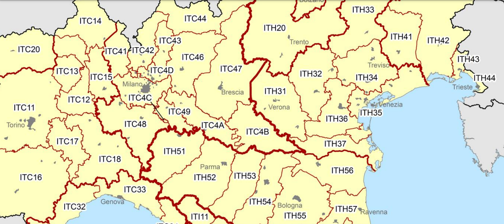
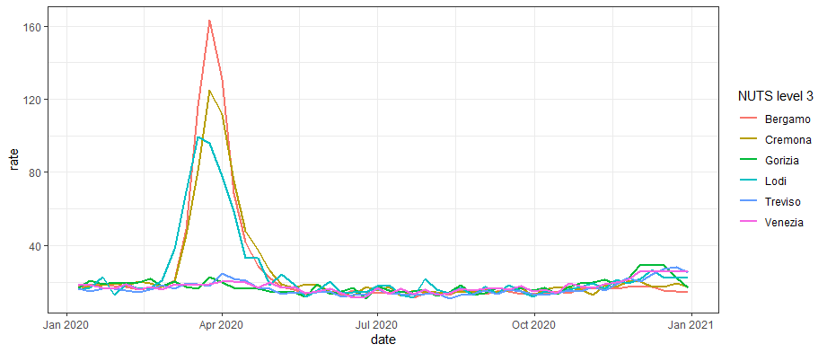
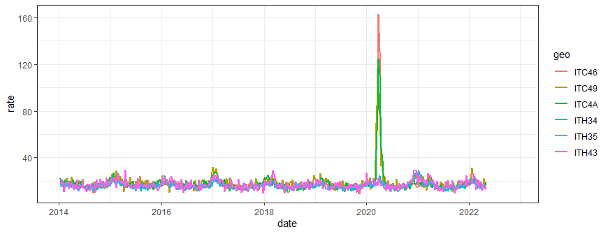
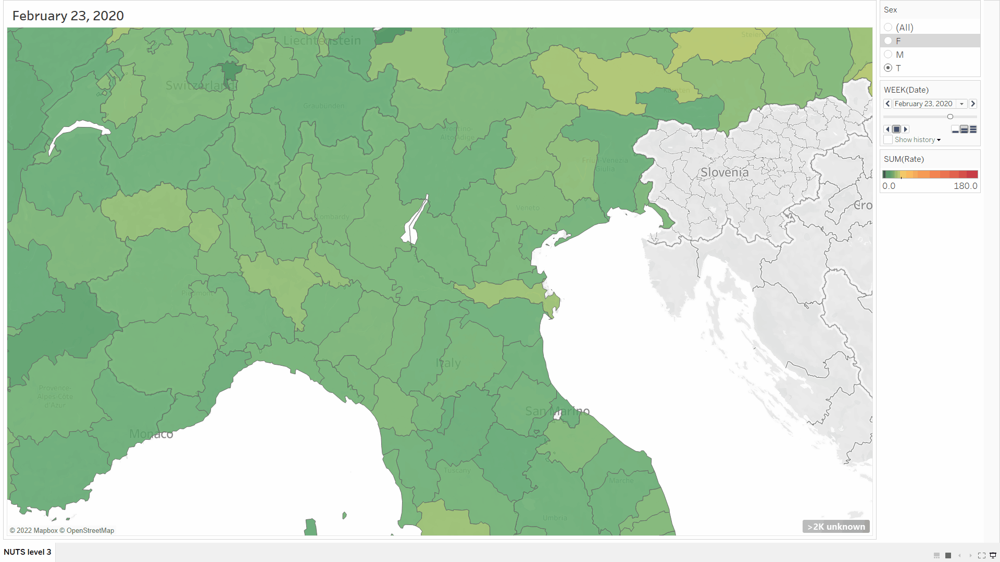

# Europe - NUTS level 3 deaths by week, sex, and 5-year age group

The huge [demo_r_mweek3](https://ec.europa.eu/eurostat/estat-navtree-portlet-prod/BulkDownloadListing?dir=data&sort=1&sort=2&start=d) dataset has been published by EUROSTAT (scroll a bit down to find it in the listing). 

This dataset has been processed to generate population standardized rates mortality rates in 5 year bins (& all ages) split by sex (& all sexes). In addition, Age Standardized Mortality Rates ([ASMR](https://ec.europa.eu/eurostat/statistics-explained/index.php?title=Glossary:Standardised_death_rate_(SDR)https://ec.europa.eu/eurostat/statistics-explained/index.php?title=Glossary:Standardised_death_rate_(SDR)) - [revised ESP2013](https://ec.europa.eu/eurostat/en/web/products-manuals-and-guidelines/-/ks-ra-13-028)) is calculated for all ages, ages 0 to 65, and ages 65+.

The data is provided for NUTS level 3 regions of Europe. See the [European NUTS 2021 classification](https://ec.europa.eu/eurostat/web/nuts/background) for more information about those regions.

Features of the dataset:
 	1. Region population counts go back to 2014, whereas the mortality data goes back to 2000 for some regions.
 	2. The 2022 population (not provided) is linearly extrapolated the 2022 based on the 2020 - 2021 slope.
 	3. During the year, the population is linearly interpolated to obtain an estimate of the population for a certain week of the year.
 	4. In the original dataset there are death counts attributed to year 2021 week 99, which is ignored in the ASMR calculations for year 2021.
 	5. The `UNK` age category is excluded from the ASMR calculation as well.
 	6. Handling of dates... the data comes in year-week format, I did a quick & dirty "2021W11" -> "2021-01-01" + 11*weeks. This is only relevant for the `date` column to be used as a dimension for plotting. The dataset retains the original year & week columns.
 	7. The dataset inherits bugs from the original data source, as well as new bugs that have been introduced during processing. **Beware - beta quality!**

# An example how to use the dataset in R

Let's look at how the COVID-19 outbreak started in Italy back in March of 2020. Below is a map of the northern part of Italy labeled by the NUTS level 3 regions codes.



Using this dataset, it is easy to see that the pandemic, as viewed through the lens of mortality, started first in Lodi, leading approximately by a week the neighboring regions of Bergamo and Cremona. The ASMR reached it's highest level of excess in Bergamo in week of 12 of 2020, measuring 163 deaths per 100k per week, a value ~ 10x higher than expected based on previous years.

```R
# the dataset is loaded into the variable 'mort'
mort %>%
  filter(geo %in% c("ITC49", "ITC4A", "ITC46", "ITH34", "ITH35", "ITH43"),
         sex == "T", age == "ASMR",  date > "2020-01-01", date < "2021-01-01") %>%
  ggplot(aes(x = date, y = rate, color = geo)) +
  geom_line(size = 1) +
  theme_bw()
```



To see how extreme these events must have been in Lodi, Cremona, and Bergamo, one can plot the same subset of data on a larger timescale.

```R
# the dataset is loaded into the variable 'mort'
mort %>%
  filter(geo %in% c("ITC49", "ITC4A", "ITC46", "ITH34", "ITH35", "ITH43"),
         sex == "T", age == "ASMR",  date > "2014-01-01") %>%
  ggplot(aes(x = date, y = rate, color = geo)) +
  geom_line(size = 1) +
  theme_bw()
```



# An example how to use the dataset in Tableau

One can load the dataset to a Tableau and use the in-built recognition of EU NUTS regions by Tableau to plot the values geographically. My dashboard (VIP) can be accessed online [here](https://public.tableau.com/app/profile/hmatejx/viz/demo_r_mweek3_pjangrp3/NUTSlevel3?publish=yes). I've used the dashboard to generate the animation below, again showing the initial spread of COVID-19 in Northern Italy in March - April of 2020. I believe the data is compatible with geographic spreading.



The animation below shows the complete Europe area from January 2020 - December 2021. Note that some countries are still missing (I don't know yet if this is a bug of the dataset or an incompatibility of the NUDS coding and version of Tableau Public that I'm using).


